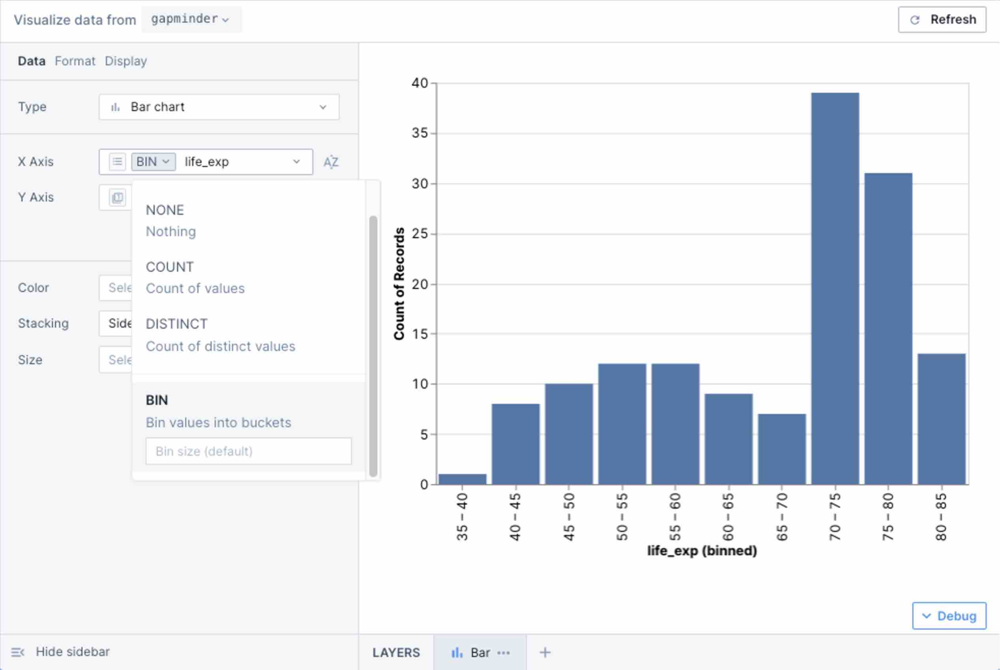
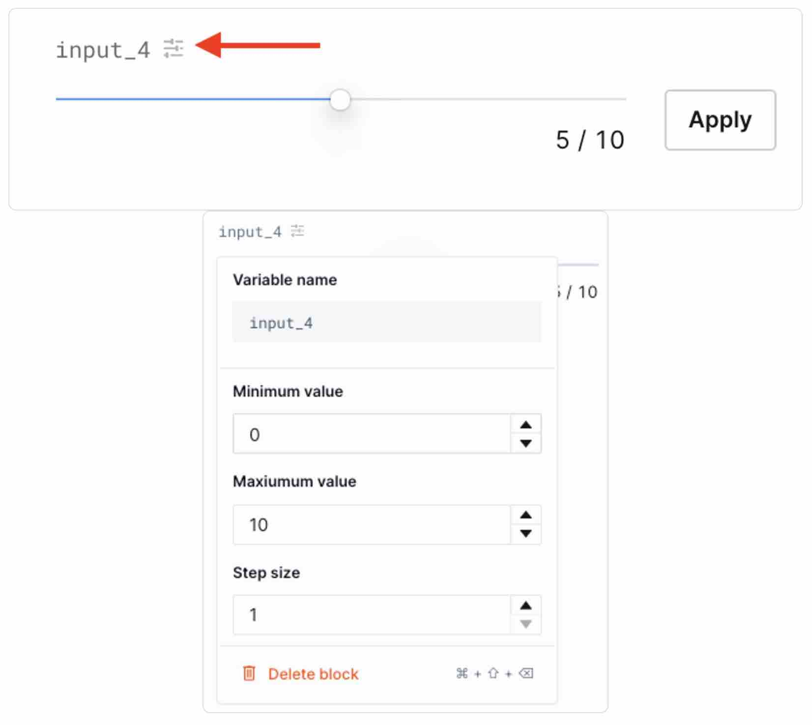

Sin duda alguna, los [cuadernos de Jupyter](https://www.camartinezbu.com/posts/una-introduccion-a-jupyter/) son una de las herramientas más útiles en el arsenal de un científico de datos. Ayudan en el prototipado rápido de soluciones, así como en la documentación y reproducibilidad de modelos, gracias a que permiten trabajar simultáneamente con celdas de código y celdas de texto usando [Markdown](https://en.wikipedia.org/wiki/Markdown).

En este post quiero contarte sobre dos herramientas que me gusta usar para trabajar con cuadernos de Jupyter: Google Colab y Deepnote. Además de permitir la ejecución de tus cuadernos en servidores remotos, tienen varias funcionalidad específicas que puedes encontrar de utilidad.

## Introducción

**[Google Colab](https://colab.research.google.com/)**, es un servicio de Google que te permite ejecutar cuadernos de Jupyter en sus servidores. Dado que está inmerso en la suite de productos de Google, puedes hacer interactuar con gran facilidad el cuaderno con archivos que tengas en la nube de Google Drive. Arrancar a trabajar con Colab es muy fácil, dado que te provee un ambiente de trabajo que tiene instalados Python 3.8, así como muchas librerías que se usan a menudo en el campo de la ciencia de datos, como Plotly, Numpy, Pandas, Matplotlib o Tensorflow.

Por su parte, **[Deepnote](https://deepnote.com)** es un producto que consiste en cuadernos de Jupyter que te permiten trabajar de forma colaborativa. Los cuadernos de Deepnote permiten la conexión con fuentes de datos como Google BigQuery, Snowflakle, PostgreSQL, Amazon RedShift, entre otros. Además de varias versiones de Python, los cuadernos de Deepnote también incluyen ambientes con varias versiones de R.

> Técnicamente, Google Colab también tiene la opción de trabajar con ambientes de R. No obstante, la interfaz de Colab no permite seleccionar este ambiente; es necesario entrar a través de un enlace como este [https://colab.research.google.com/notebook#create=true&language=r](https://colab.research.google.com/notebook#create=true&language=r). E incluso en ese escenario, Deepnote ofrece mayor facilidad para cambiar entre versiones de Python y R.

## Funciones y características

**Google Colab** te ofrece la experiencia más parecida a los cuadernos de Jupyter estándar. Te permite crear celdas de texto y código, en los que puedes incluir imágenes, videos, enlaces a otros cuadernos, etc. Asimismo, incluye todas las funciones de *[magics](https://nbviewer.org/github/ipython/ipython/blob/1.x/examples/notebooks/Cell%20Magics.ipynb)* de jupyter. Estas son líneas de código que puedes escribir el inicio de la celda para cambiar la manera como se ejecuta. Algo así como decoradores para el contenido de la celda.

> Por ejemplo, si escribes `%%timeit` al inicio de una celda en Colab, la salida te mostrará el tiempo de ejecución del código que está en ella.

La cosa se pone más interesante con **Deepnote**. Además de las celdas de texto y código, Deepnote incluye celdas de SQL, de Gráficos y de Entrada. Veamos qué hace cada una de ellas.

- **SQL**: Para proyectos en los que tienes enlazada una base de datos SQL, Deepnote te permite interactuar directamente con queries desde el cuaderno y trabajar con el resultado como si fuera un DataFrame de Pandas. Por lo pronto, esta función sirve únicamente para los cuadernos con Python.

*Fuente: [Documentación de Deepnote](https://deepnote.com/docs/sql-cells)*

- **Gráficos**: Las celdas de gráficos permiten crear visualizaciones de datos de DataFrames de pandas sin usar una línea de código. En vez de tener que buscar la documentación de `matplotlib` o `seaborn`, Deepnote te ofrece una interfaz más parecida a los programas de inteligencia de negocios, en la que puedes seleccionar el tipo de gráfico, las variables y los atributos que quieres mapear.

*Fuente: [Documentación de Deepnote](https://deepnote.com/docs/chart-blocks)*

- **Entrada**: Con Deepnote también se pueden hacer tableros de visualización básicos. Estas celdas contienen entradas de texto, selección, sliders y fechas que interactúan con variables del ambiente de trabajo para volverlos interactivos. ¡Puedes prototipar tableros antes de pasarlos a Shiny o Dash!

*Fuente: [Documentación de Deepnote](https://deepnote.com/docs/input-blocks)*

## Comparación de precios

Tanto **Google Colab** como **Deepnote** incluyen planes gratuitos y pagos. La diferencia está en el enfoque con el que cada servicio diferencia los niveles de pago: el precio de Google Colab depende en mayor medida de la capacidad de computación que requieres y el de Deepnote, de las funcionalidades de colaboración que requieras.

### Planes gratuitos

El plan gratuito de **Google Colab** es el plan por defecto cuando abres un cuaderno en esta plataforma. Este te permite ejecutar el código en tus cuadernos, tanto en CPU como GPU y TPU de Google, sujeto a dispinibilidad. Esto significa que en momentos de alta demanda te puedes encontrar con que no puedes usar tarjetas gráficas. No obstante, puedes crear un número ilimitado de cuadernos de Colab con tu cuenta.

En **Deepnote**, el plan gratuito incluye la creación de hasta 5 proyectos en los que puedes invitar a colaborar a máximo 3 personas. Además, en este nivel tienes acceso ilimitado CPU con 5GB de RAM, pero no a tarjetas de video. Este uso está sujeto a políticas de *fair use*, por lo que Deepnote puede apagar el cuaderno si detecta algún tipo de actividad sospechosa.

### Planes pagos

**Google Colab** ofrece 2 suscripciones y un plan *Pay as you go* para acceder a computadores más poderosos y funcionalidades extra en la ejecución de los cuadernos:

- **Colab Pro**: La suscripción mensual cuesta USD $9.99 (o COP $43.165 al momento de escribir este post accediendo desde Colombia). Obtienes 100 *unidades de cómputo* al mes, así como acceso a máquinas con más memoria (hasta 32GB) y una terminal en la máquina virtual.
- **Colab Pro+**: Esta opción cuesta USD $49.99 (o COP $215.996). Incluye todo lo que viene en Colab Pro, con 400 *unidades de cómputo* adicionales, acceso a máquinas con aún más memoria (hasta 52GB) y permite la ejecucuón de los cuadernos por hasta 24 horas sin que tengas que tener la ventana del navegador abierta.
- ***Pay as you go***: En este caso pagas solamente por las *unidades de computación* que necesites. Y los precios están acorde con lo que te ofrecen las dos suscripciones anteriores: 100 unidades te cuestan USD \$9.99 y 500 te cuestan USD \$49.99.

> Las unidades de computación permiten la ejecución del cuaderno en las máquinas virtuales de Google Cloud. Son una especie de medida de tu acceso a sus servidores. Para las suscripciones mensuales, estas unidades de computación expiran luego de 90 días desde la compra.

Por su parte, **Deepnote** ofrece dos suscripciones diseñadas para equipos y empresas, con funciones avanzadas para la colaboración:

- **Deepnote Team**: Este plan cuesta USD $39 por editor por mes. Contempla la creación de un número ilimitado de proyectos en los que pueden colaborar cualquier número de editores. Además, te da acceso a máquinas virtuales de hasta 16GB de RAM –y de hasta 128GB bajo el modelo *pay as you go*– e integraciones con servicios como Snowflake, SQL Server, BigQuery, Redshift, entre otras; que no se encuentran disponibles en la versión gratuita. Además, permite la ejecución de cuadernos por hasta 24 horas sin que tengas que interactuar con el navegador.
- **Deepnote Enterprise**: No hay un precio fijo para este plan, sino que tienes que cotizar con el equipo de ventas de Deepnote. Además de las opciones incluidas en el plan anterior, este incluye un historial ilimitado de versiones de los cuadernos, soporte dedicado y la opción de construir máquinas personalizadas según tu necesidad. Incluso es posible la instalación de una nube privada *on-premise* en tu organización.

## Conclusión

Tanto Google Colab como Deepnote son herramientas muy interesantes para ejecutar cuadernos de Jupyter en servidores remotos. Y afortunadamente, cuentan con versiones gratuitas para que pruebes sus funcionalidades y te des cuenta cuál se adecúa mejor a tu flujo de trabajo. Google Colab puede ser más útil si eres un entusiasta de la ciencia de datos y quieres poner en marcha proyectos de pequeña escala. Mientras que Deepnote puede ser una solución más adecuada si el tamaño de tu operación es mucho más grande y necesitas acceder a soporte especializado.

¿Conoces otra herramienta que permite la ejecución de cuadernos de Jupyter en la Nube? Cuéntame en los comentarios o en mis redes sociales.
