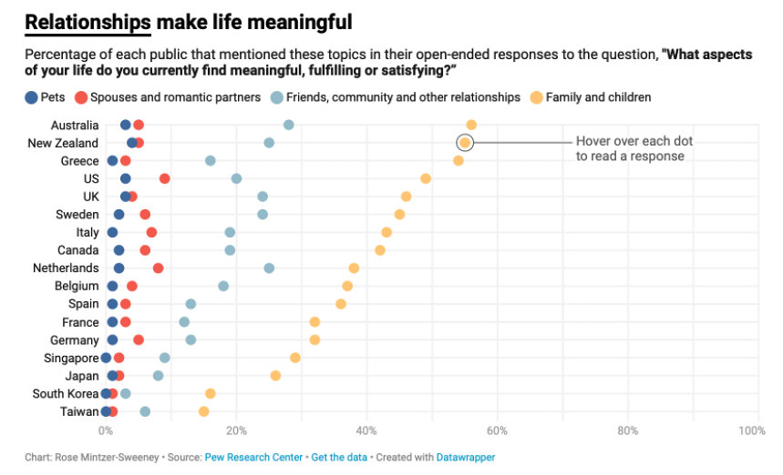
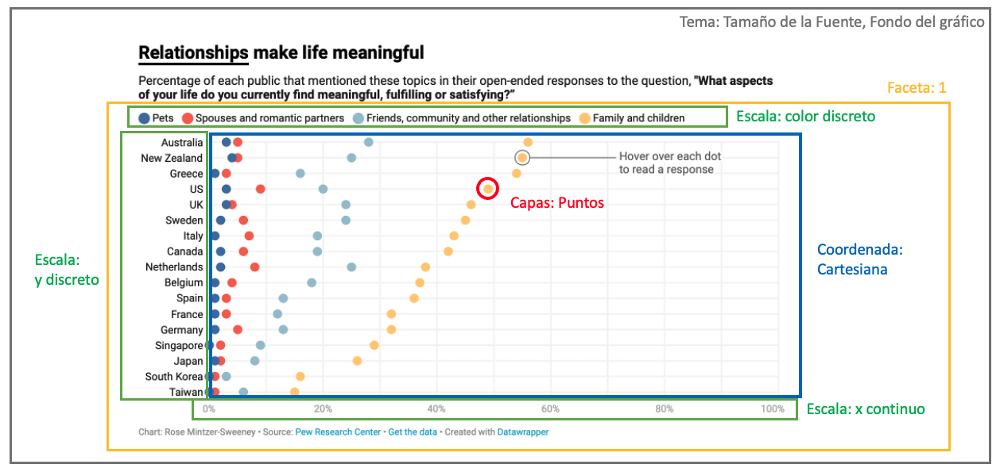
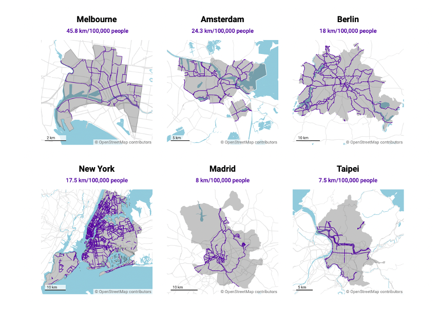
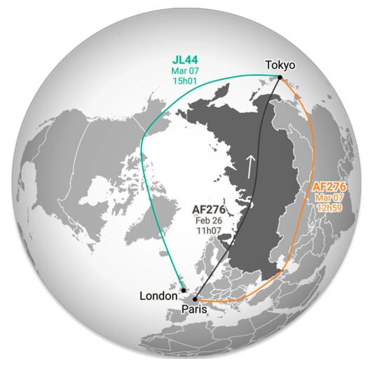

En diversas aplicaciones de visualización de datos, la creación de un gráfico se limita a dar clic a un botón que te muestra directamente el resultado final. Si bien esto es muy conveniente desde el punto de vista de un usuario ocasional, también te puede quitar la posibilidad de entender con más detalle los elementos que hacen que un gráfico funcione. Por esta razón, hoy quiero hablarte de la Gramática de los Gráficos.

## La gramática de los gráficos

La gramática de los gráficos es un esquema desarrollado por Claus Wilke en un [libro homónimo](https://www.amazon.com/Grammar-Graphics-Statistics-Computing/dp/0387245448), en el que detalla los elementos que constituyen un gráfico. Si has trabajado con {ggplot2} en R, verás que ya tienes un entendimiento intuitivo de estos elementos, dado que este paquete se construyó con base en las lógicas de este esquema –de ahí el 'gg' de 'ggplot', **G**rammar of **G**raphics–.

En lo que sigue de esta entrada de blog, voy a seguir la explicación que hacen en el libro de *[ggplot2: Elegant Graphics for Data Analysis](https://ggplot2-book.org/introduction.html)*, porque considero que tiene una explicación un poco más sencilla y menos técnica que el libro de Wilke.

## Datos y mapeo

De acuerdo con este esquema, los gráficos se componen de dos elementos clave: **datos y mapeo**. 

Los **datos** son la información que se va a transformar en un formato visual para que tu audiencia los pueda consumir. Si lo pensamos como una pregunta, los datos son el *¿qué?*.

Por su parte, el **mapeo** –o *mapping* en inglés– es la forma en la que se va a realizar esa transformación. Es decir, son el *¿cómo?* El mapeo se compone de los siguientes 5 elementos: capas, escalas, coordenadas, facetas y tema.

### a. Capas

Las capas son las *geometrías* que ves directamente en el gráfico, que están asociadas a un *estadístico* construido a partir de los datos: una identidad, una media, una mediana, un conteo de observaciones, etc.

Por ejemplo, la capa que caracteriza a un gráfico de dispersión es un conjunto de puntos que muestran un valor que está en los datos originales, mientras que la capa que caracteriza a un gráfico de columnas es un conjunto de barras que pueden estár asocadas al conteo de observaciones en ciertos rangos de valores de una variable.

### b. Escalas

Las escalas describen la forma en que se presentan las capas de manera visual en el gráfico. Puedes tener escalas de posición (ejes x, y, o z), de color, de tamaño, de forma, de tipo de línea, etc. Estas escalas pueden ser discretas o contínuas, dependiendo de los datos y del mensaje que quieras enviar con el gráfico.

Siguiendo el ejemplo anterior, en un gráfico de dispersión se suele trabajar con unos ejes x e y contínuos, mientras que en el gráfico de columnas suele aparece un eje x discreto y un eje y contínuo. Lo anterior, al margen de que quieras añadir más información coloreando los elementos del gráfico según una variable adicional.

### c. Coordenadas

El sistema de coordenadas describe la forma cómo esas escalas y esas geometrías se pintan en el plano del gráfico, asumiendo uno en dos dimensiones. En general, el sistema de coordenadas que te vas a encontrar es el de las coordenadas cartesianas, pero cuando lidies con mapas y otras visualizaciones especiales, trendrás otros tipos de coordenadas.

### d. Facetas

Las facetas definen la manera como se pueden dividir los elementos anteriores en gráficos más pequeños. Es decir, cuando pasas de tener un gran lienzo donde se pintas todos los datos a lienzos más pequeños, separados de acuerdo con alguna variable categórica.

Por ejemplo, si tienes una variable asociada al continente para el gráfico de dispersión, podrías presentar toda la información en un sólo gráfico, o separarlo en varios gráficos del mismo tipo de acuerdo con dicha variable.

### e. Tema

Por último, el tema controla todos los demás elementos estéticos que intervienen en la manera como se ve el gráfico. Colores de los títulos, tamaño del texto, si el gráfico tiene o no un borde, etc.

Si estamos hablando de un gráfico de tiplo exploratorio, quizás el tema no es el elemento más importante. Sin embargo, para un gráfico con fines de publicación o divulgación, este cobra más importacia para capturar la atención de tu audiencia y transmitir los mensajes correctos.

No te preocupes si estos conceptos no te quedaron claros con una primera leída. Te voy a mostrar algunos ejemplos para que sea un poco más evidente.

## Ejemplos

Todos los ejemplos que te muestro a continuación los extraje del blog de [Datawrapper](https://www.datawrapper.de). Este es un excelente recurso para que revises si quieres un poco de inspiración para armar tus gráficos.

### Ejemplo 1

Este gráfico muestra las respuestas de las personas encuestadas por Pew Research Center en varios países, con respecto a los aspectos que le dan sentido a sus vidas. Te invito a que, antes de seguir, le des una mirada al gráfico y trates de extraer los elementos que se describen con anterioridad.

*Fuente: https://blog.datawrapper.de/meaning-of-life-international-survey/*

Veamos cada uno de los elementos por separado:

* **Capas**. Como puedes ver, la geometría que se usa para mostrar los datos es un conjunto de puntos.
* **Escalas**. Tenemos 3 escalas que conviven en el gráfico:
  * La escala x contínua que muestra el porcentaje de respuestas que incluyeron cada uno de los asuntos.
  * La escala y discreta con los países en los que se realizó la encuesta y,
  * La escala de color discreto que describe los asuntos puntuales como mascotas, pareja, etc.
* **Coordenadas**. En este caso, el sistema de coordenadas es cartesiano.
* **Facetas**. Tenemos un solo *lienzo*, es decir sólo una faceta.
* **Tema**. Todos los elementos adicionales, como que el título sea más grande que el resto de texto y esté en negrilla, que el fondo sea blanco, que la nota al ginal del gráfico esté en color gris, etc.

*Fuente: Elaboración propia con base en https://blog.datawrapper.de/meaning-of-life-international-survey/*

### Ejemplo 2

Este gráfico muestra la red de ciclorrutas en 6 ciudades del mundo. Repite el ejercicio anterior y abajo te muestro el resultado.

*Fuente: https://blog.datawrapper.de/international-bike-lanes-maps/*

Veamos:

* **Capas**. Este pudo ser un poco más dificil de abstraer, pero en general los mapas usan puntos, líneas y polígonos para mostrar los datos georreferenciados. En este caso, ignorando el mapa de fondo, el borde de cada ciudad es un polígono y las ciclorrutas se representan con líneas.
* **Escalas**. A pesar de que ya no estamos trabajando con un gráfico como el de arriba, las escalas son de posición: ejes x e y contínuos. Podríamos pensar también que los colores del polígono (gris) y de las líneas (morado) son una escapa de color, aunque no parecen estar asociadas a una variable específica en los datos.
* **Coordenadas**. Como lo mencionaba con anterioridad, cuando hablamos de mapas las coordenadas ya no son cartesianas sino alguna proyección específica del volúmen tridimensional de la tierra, que no conocemos.
* **Facetas**. En este caso, tenemos un mapa similar para 6 ciudades distintas. Entonces podemos hablar de que tenemos 6 facetas separadas.
* **Tema**. Tenemos el color de fondo en blanco, el nombre de las ciudades un poco más grande que el resto de texto y el subtítulo para cada ciudad en morado.
  

*Fuente: Elaboración propia con base en https://blog.datawrapper.de/international-bike-lanes-maps/*

### Ejemplo 3

Vamos con el último. Los dos gráficos muestran el recorrido de las rutas de avión de Tokyio a Londres y París, y cómo se redirigieron para no pasar por espacio aéreo Ruso. Ambos gráficos contienen la misma información pero diferen en sólo uno de los elementos del mapeo. ¿Cuál crees que es?

*Fuente: https://blog.datawrapper.de/flight-routes-map-projections/*

* **Capas**. Estos mapas emplean las 3 geometrías básicas de los mapas: puntos, líneas y polígonos.
* **Escalas**. Al igual que el ejemplo anterior, se están pintando los mapas en unas escalas x e y contínuas.
* **Coordenadas**. Esta es la principal diferencia entre los dos. Mientras el primero utiliza una proyección llamada Mercator Web, el segundo usa una proyección ortográfica.
* **Facetas**. Como ambos mapas están por separado, podemos decir que tienen 1 faceta cada uno.
* **Tema**. No podemos decir mucho del tema más allá del color de fondo y el formato de la letra de las etiquetas de las ciudades y los vuelos.

## Conclusión

Con esto, ya deberías poder identificar los elementos de la Gramática de los Gráficos en las visualizaciones que te encuentres. Pensar explícitamente en la estructura de un gráfico te va a ayudar a mejorar su diseño y, por qué no, romper algunas reglas para generar productos aún más interesantes.

Te invito a compartir este post en tus redes si te pareció útil y a que practiques los ejercicios de los ejemplos con gráficos que te encuentres en tu día a día.
